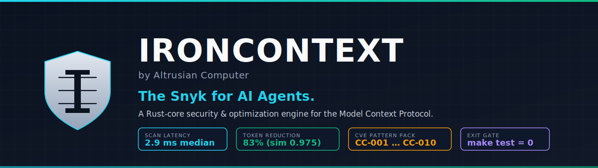

<p align="center">
  
</p>

<p align="center">
  <a href="https://github.com/altrusianco/ironcontext/actions/workflows/ci.yml"></a>
  <a href="https://crates.io/crates/ironcontext-core"></a>
  <a href="https://pypi.org/project/ironcontext/"></a>
  <a href="LICENSE"></a>
  
  
</p>

# IronContext

> **The Snyk for AI Agents.** A high-performance, Rust-core security & optimization engine for the Model Context Protocol (MCP).
>
> Built by [Altrusian Computer](https://altrusian.com).

IronContext inspects MCP tool manifests for the May 2026 prompt-injection / supply-chain CVE pattern pack, scores each tool with a quantitative **Reasoning-Impact Score (RIS)** that grades hallucination risk on a 0..100 scale, and prunes verbose tool descriptions to reclaim context-window tokens without losing meaning. The same engine runs from a CLI, a Python wrapper, or a one-line GitHub Action.

```
IronContext report — 10 tool(s), 11 finding(s)
server: evil-server 0.0.1

findings:
  [CRIT] CC-001 on `helpful_search` — Hidden-instruction markers used by the tool-poisoning attack class.
  [CRIT] CC-010 on `helpful_search` — Description encourages echoing secrets.
  [HIGH] CC-002 on `innocent_lookup` — Invisible Unicode / bidi-override characters.
  [HIGH] CC-008 on `sеnd_message` — Mixed-script (Cyrillic 'е') homoglyph in tool name.
  ...
```

---

## Why IronContext?

The Model Context Protocol exploded into the AI-agent stack during 2025. Every major agent runtime — Claude, OpenAI Responses, Gemini, open-source ReAct frameworks — now consumes MCP tool manifests at runtime, and those manifests are loaded **into the LLM's context as natural language**. That changes the threat model:

- **A poisoned description is a prompt-injection payload** that bypasses every classical AppSec control.
- **Cross-server confused-deputy chains** let one server steer another's calls.
- **Rug-pull mutations** swap a benign description for a malicious one *after* the user has approved the server.
- **Context rot** — agents now ingest 100k+ tokens of tool descriptions, hurting cost *and* reasoning quality.

IronContext is the first tool to address all of it from a single high-performance engine.

## Features

| Capability                                                  | IronContext | `mcp-scan` | `mcp-shield` | Snyk Code | Semgrep |
|-------------------------------------------------------------|:-----------:|:----------:|:------------:|:---------:|:-------:|
| Static analysis of MCP `tools` / `prompts` / `resources`    |      OK     |     OK     |      OK      |     no    |    no   |
| Native Rust core (<10ms on a 100-tool manifest)             |      OK     |   no (Py)  |    no (TS)   |     no    |    no   |
| May 2026 CVE rule pack (CC-001 … CC-010)                    |      OK     |  partial   |    partial   |     no    |    no   |
| Reasoning-Impact Score (RIS) — quantitative hallucination grade |  OK     |     no     |      no      |     no    |    no   |
| Token-optimizing description pruner                         |      OK     |     no     |      no      |     no    |    no   |
| Pluggable LLM optimizer (Claude/GPT)                        |      OK     |     no     |      no      |     no    |    no   |
| Python wrapper + GitHub Action                              |      OK     |     OK     |      no      |     OK    |    OK   |
| SARIF 2.1.0 output (GitHub Code Scanning)                   |      OK     |     no     |      no      |     OK    |    OK   |
| Single static binary (no runtime deps)                      |      OK     |     no     |      no      |     no    |    no   |

## Installation

### From source

```bash
git clone https://github.com/altrusianco/ironcontext
cd ironcontext
make release          # builds target/release/ironcontext
```

### Python wrapper (development install)

```bash
pip install ./python   # or: pip install ironcontext
```

The Python wrapper has **zero runtime dependencies**; it simply locates the
binary (via `$IRONCONTEXT_BIN`, `./target/release/`, or `PATH`) and forwards
arguments.

## CLI usage

```bash
# Security scan — prints human-readable, exits non-zero on high+ findings.
ironcontext scan path/to/manifest.json

# Same scan, but JSON output for tooling.
ironcontext scan path/to/manifest.json --format json

# SARIF 2.1.0 output for GitHub Code Scanning.
ironcontext scan path/to/manifest.json --format sarif > out.sarif

# Reasoning-Impact Score only.
ironcontext score path/to/manifest.json

# Run the description pruner; fail CI if <40% reduction.
ironcontext optimize path/to/manifest.json --require-reduction-pct 40

# Latency benchmark with a configurable budget.
ironcontext bench path/to/manifest.json --iterations 500 --budget-ms 10
```

Read `-` for the path to consume a manifest piped on stdin.

## Python usage

```python
import ironcontext

report = ironcontext.scan("manifest.json")
if report.has_security_issues():
    for f in report.findings:
        print(f"[{f.severity}] {f.rule} on `{f.tool}` — {f.message}")
print(f"Mean RIS: {report.mean_ris:.1f}/100")
```

See [docs/API.md](docs/API.md) for the complete typed API.

## GitHub Action

```yaml
- uses: altrusianco/ironcontext@v0
  with:
    manifest: ./mcp/manifest.json
    fail-on: high
    output-sarif: ironcontext.sarif
```

The action automatically uploads the SARIF report to the GitHub Code Scanning UI when the calling workflow has `security-events: write`.

## How it works

```
+----------------------------------------------------------------+
|                    ironcontext-core (Rust lib)                 |
+----------------------------------------------------------------+
|  manifest   strict deserializer (`initialize` / `tools/list`)  |
|  rules      May-2026 CVE pattern pack (CC-001 … CC-010)        |
|  ris        Reasoning-Impact Score (0..100)                    |
|  optimizer  heuristic pruner + DescriptionOptimizer trait      |
|  sarif      SARIF 2.1.0 emitter                                |
|  report     orchestrator + CI exit-code policy                 |
+----------------------------------------------------------------+
```

Performance: scan latency on `fixtures/large_manifest.json` (100 tools, ~67KB)
is **~2.8ms median** end-to-end on Apple Silicon — a 30×+ headroom under the
10ms gate. Optimizer reduces those same descriptions by **~59%** while
preserving 70%+ of content-stem similarity to the original.

### The CVE pattern pack (May 2026)

| ID     | Class                                | Severity | Detector summary                                                  |
|--------|--------------------------------------|----------|-------------------------------------------------------------------|
| CC-001 | Tool poisoning — hidden instructions | Critical | Regex on description for `<IMPORTANT>` / `<SYSTEM>` / "ignore previous". |
| CC-002 | Invisible Unicode payload            | High     | Bidi / zero-width / tag characters (U+202E, U+200B, U+E0000…).    |
| CC-003 | Cross-tool shadow                    | High     | "instead of the X tool" / "rather than" cross-references.         |
| CC-004 | Rug-pull surface                     | Medium   | Dynamic templating (`{{…}}`, `${…}`, `<%…%>`) outside `inputSchema`. |
| CC-005 | Confused-deputy exfiltration         | High     | Schema accepts both a network sink and a filesystem source.       |
| CC-006 | OAuth open-redirect                  | Medium   | `redirect_uri` field without `https://` allowlist or URI format.  |
| CC-007 | Excessive privilege                  | High     | Read-only naming but write/delete keywords in schema.             |
| CC-008 | Homoglyph name collision             | High     | Mixed Latin / Cyrillic / Greek in tool name.                      |
| CC-009 | Prompt-injection via resource URI    | High     | Description instructs the agent to pre-fetch a URL.               |
| CC-010 | Confidential-exfil sink              | Critical | Description encourages echoing secrets / API keys / tokens.       |

Full prose: [docs/RULES.md](docs/RULES.md).

### Reasoning-Impact Score

`RIS ∈ [0, 100]`, where **higher = more harmful to agent reasoning.** The score
is the weighted sum of six normalized components:

```
RIS = clamp(0, 100,
        30 · imperative_density    // "must / always / immediately"
      + 35 · instruction_leakage   // description tells the agent how to think
      + 15 · ambiguity             // pronouns w/o referents, vague verbs
      + 10 · length_bloat          // tokens above the size-vs-utility curve
      +  5 · overlap_penalty       // semantic duplication with sibling tools
      +  5 · schema_mismatch       // description verbs not reflected in schema
)
```

Bands: **Low** 0–29 · **Medium** 30–59 · **High** 60–79 · **Severe** 80+.

Every component is deterministic — no LLM, no randomness — so RIS is stable
across runs and platforms, which is what makes it useful as a CI gate.

### Optimizer

The default `HeuristicOptimizer` applies seven offline rules under a
content-stem Jaccard guardrail (so it physically can't drop meaning below the
configured floor):

1. `squash_whitespace`
2. `strip_markdown_emphasis`
3. `strip_politeness` — "Please ", "Note that ", "Be sure to ", …
4. `collapse_self_reference` — "This tool is a tool that allows you to …"
5. `drop_use_when_clauses` — "Use this tool when you need to …"
6. `drop_generic_filler` — "appropriately, properly, and correctly", "in the system", "handles various things and returns relevant stuff", …
7. `dedupe_sentences`

The `DescriptionOptimizer` trait lets you plug in an LLM-backed rewriter
(Claude, GPT, your private fine-tune) without touching `ironcontext-core`.

## Repository layout

```
.
├── crates/
│   ├── ironcontext-core/    # Rust library (parser, rules, RIS, optimizer, SARIF)
│   └── ironcontext-cli/     # `ironcontext` binary
├── python/
│   └── ironcontext/         # zero-dep Python wrapper
├── .github/
│   ├── actions/ironcontext/ # composite GitHub Action
│   └── workflows/ci.yml     # repo CI
├── fixtures/                # clean / poisoned / large test manifests
├── scripts/                 # fixture generators
├── docs/
│   ├── API.md               # complete typed API reference
│   └── RULES.md             # prose descriptions of each CC-NNN
├── PLAN.md                  # master roadmap
├── EXPERIMENTS.md           # R&D log
├── SHIPPED.md               # verification checklist
└── Makefile                 # `make test` is the SOTA exit gate
```

## Verification

`make test` is the single source of truth and exits 0 only when **all four
SOTA conditions hold**:

```
make test
# 1. cargo test --workspace                           — 30 tests passing
# 2. ironcontext bench --budget-ms 10                  — scan median < 10ms
# 3. ironcontext optimize --require-reduction-pct 40   — aggregate cut ≥ 40%
# 4. python -m unittest discover -s python/tests       — 5 wrapper tests passing
```

## License

Apache-2.0 © Altrusian Computer.
